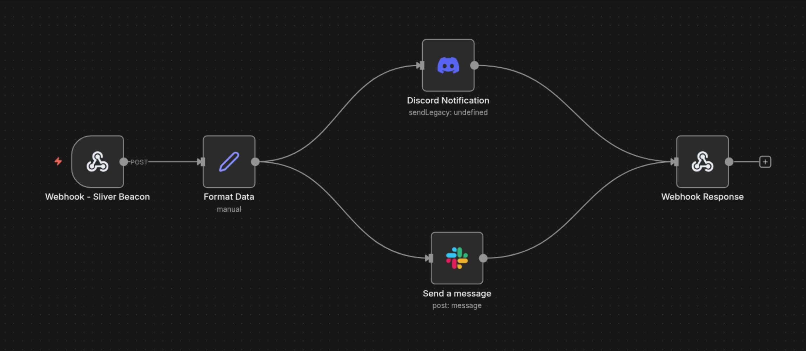

# Complete Installation Guide

This guide provides step-by-step instructions for setting up the Sliver C2 + n8n integration from scratch.

---

## Table of Contents

1. [Prerequisites](#prerequisites)
2. [Step 1: Install n8n](#step-1-install-n8n)
3. [Step 2: Install Python Dependencies](#step-2-install-python-dependencies)
4. [Step 3: Deploy the Python Monitor Script](#step-3-deploy-the-python-monitor-script)
5. [Step 4: Create Systemd Service](#step-4-create-systemd-service)
6. [Step 5: Import n8n Workflow](#step-5-import-n8n-workflow)
7. [Step 6: Configure Discord Integration](#step-6-configure-discord-integration)
8. [Step 7: Configure Slack Integration](#step-7-configure-slack-integration-optional)
9. [Step 8: Activate the Workflow](#step-8-activate-the-workflow)
10. [Step 9: Test the Integration](#step-9-test-the-integration)

---

## Prerequisites

Before starting, ensure you have:

- **Sliver C2 Server** installed and running
- **Sliver client config** file generated (`~/.sliver-client/configs/`)
- **Python 3.7+** with pip
- **Discord webhook URL** (create in Discord server settings)
- **Slack workspace** with permissions to create apps (optional)
- **Linux/WSL environment** (for systemd service)

---

## Step 1: Install n8n

n8n is the workflow automation platform that will receive webhooks and send notifications.

### 1.1 Install Node Version Manager (NVM)

```bash
curl -o- https://raw.githubusercontent.com/nvm-sh/nvm/v0.40.3/install.sh | bash
```

### 1.2 Load NVM into your shell

```bash
source ~/.zshrc  # or source ~/.bashrc if using bash
```

### 1.3 Install Node.js and n8n

```bash
# Install Node.js version 24
nvm install 24

# Install n8n globally
npm install n8n -g
```

### 1.4 Start n8n

```bash
n8n start
```

n8n will be accessible at `http://localhost:5678`

---

## Step 2: Install Python Dependencies

The monitoring script requires the Sliver Python client library and requests.

```bash
pip install sliver-py requests
```

Or if you have external dependencies issues, you can use a virtual environment in Python:

```bash
python3 -m venv venv
source venv/bin/activate
pip install sliver-py requests
```

---

## Step 3: Deploy the Python Monitor Script

This script connects to your Sliver server and monitors for new beacon/session connections.

### 3.1 Download the script

```bash
# Navigate to your working directory
cd /home/kali/n8n/  # or your preferred location

# Download the script
wget https://raw.githubusercontent.com/0x0Trace/n8n-Sliver-C2-implant/main/sliver_beacon_monitor.py
```

### 3.2 Configuration Variables to Update

Edit `sliver_beacon_monitor.py` and update these variables:

```python
# Line 17: Your n8n webhook URL (will be created in Step 5)
N8N_WEBHOOK_URL = "http://localhost:5678/webhook/sliver-beacon"

# Line 18: Path to your Sliver client config file
SLIVER_CONFIG_PATH = os.path.expanduser("~/.sliver-client/configs/kali_localhost.cfg")
```

**Finding your Sliver config:**
```bash
ls ~/.sliver-client/configs/
```

### 3.3 Test the script manually

```bash
# Make it executable
chmod +x sliver_beacon_monitor.py

# Run it manually to test
python3 sliver_beacon_monitor.py
```

You should see:
```
[*] Loading config from: /home/kali/.sliver-client/configs/kali_localhost.cfg
[+] Connected to Sliver server
[*] Monitoring for new connections...
```


## Step 4: Create Systemd Service

To run the monitor automatically in the background, create a systemd service.

### 4.1 Find your Python path

```bash
which python3
```

Copy the output (e.g., `/home/kali/n8n/venv/bin/python` or `/usr/bin/python3`)

### 4.2 Download and configure service file

```bash
# Download the service file
sudo wget -O /etc/systemd/system/sliver-monitor.service \
  https://raw.githubusercontent.com/0x0Trace/n8n-Sliver-C2-implant/main/sliver-monitor.service

# Or copy from repository
sudo cp sliver-monitor.service /etc/systemd/system/
```

### 4.3 Edit the service file

```bash
sudo nano /etc/systemd/system/sliver-monitor.service
```

**Update these lines:**
- Line 10: Replace `User=kali` with your username
- Line 16: Replace Python path with output from `which python3`
- Line 16: Replace script path if you installed it elsewhere
- Line 19: Update `WorkingDirectory` to match your script location

Example:
```ini
[Service]
Type=simple
User=yourusername
ExecStart=/usr/bin/python3  /home/yourusername/n8n/sliver_beacon_monitor.py
WorkingDirectory=/home/yourusername/n8n
```

### 4.4 Enable and start the service

```bash
# Reload systemd
sudo systemctl daemon-reload

# Enable service to start on boot
sudo systemctl enable sliver-monitor.service

# Start the service
sudo systemctl start sliver-monitor.service

# Check status
sudo systemctl status sliver-monitor.service
```

### 4.5 View logs

```bash
# Follow live logs
sudo journalctl -u sliver-monitor.service -f

# View recent logs
sudo journalctl -u sliver-monitor.service -n 50
```

---

## Step 5: Import n8n Workflow

Now we'll create the workflow in n8n that receives webhooks and sends notifications.

### 5.1 Access n8n

Open your browser and navigate to `http://localhost:5678`

### 5.2 Import the workflow

1. Click **Workflows** in the left sidebar
2. Click **Add workflow** → **Import from File**
3. Click **"Select file to import"**
4. Navigate to the repository and select `n8n_workflow_template.json`
5. Click **Import**

Alternatively, you can copy the JSON content from `n8n_workflow_template.json` and paste it directly.

**Note:** After importing, you'll need to configure your Discord and Slack credentials (the template uses placeholders).

### 5.3 Workflow Visual Overview



The workflow consists of 5 nodes:

1. **Webhook - Sliver Beacon**: Entry point (receives POST requests)
2. **Format Data**: Transforms data for notifications
3. **Discord Notification**: Sends rich embed to Discord (runs in parallel)
4. **Send a message**: Posts to Slack channel (runs in parallel)
5. **Webhook Response**: Returns success to caller

### 5.4 Verify Webhook Path

Click on the **"Webhook - Sliver Beacon"** node and verify:
- **HTTP Method**: POST
- **Path**: `sliver-beacon`
- This creates the webhook URL: `http://localhost:5678/webhook/sliver-beacon`

---

## Step 6: Configure Discord Integration

### 6.1 Create Discord Webhook

1. Open your Discord server
2. Go to **Server Settings** → **Integrations** → **Webhooks**
3. Click **New Webhook**
4. Name it (e.g., "Sliver C2 Alerts")
5. Select the channel for notifications
6. Click **Copy Webhook URL**

### 6.2 Add to n8n

1. In the n8n workflow, click the **Discord Notification** node
2. Under **Credentials**, click **Create New Credential**
3. Select **Discord Webhook**
4. Paste your webhook URL
5. Click **Save**

---

## Step 7: Configure Slack Integration (Optional)

If you want Slack notifications in addition to Discord, follow these steps.

### Phase 1: Create the Slack App

1. Go to the [Slack API Console](https://api.slack.com/apps)
2. Click **Create New App** → **From scratch**
3. Name the app (e.g., `n8n Automation`) and select your target Workspace

### Phase 2: Configure Permissions

1. On the left sidebar, go to **Features** → **OAuth & Permissions**
2. Scroll down to the **Scopes** section
3. Under **Bot Token Scopes**, add the following:
   - `chat:write` (Required to send messages)
   - `chat:write.public` (Optional: Allows posting to public channels without being invited)
   - `files:write` (Optional: If you plan to upload files/images)

### Phase 3: Install & Get Token

1. Scroll to the top of the **OAuth & Permissions** page
2. Click **Install to Workspace** and allow access
3. Copy the **Bot User OAuth Token**
   - It starts with `xoxb-...`

### Phase 4: Configure n8n Credentials

1. In the n8n workflow, click the **Send a message** (Slack) node
2. Under **Credentials**, click **Create New Credential**
3. Select **Slack API**
4. **Crucial Step:** In the "Authentication" dropdown, select **Access Token** (Do not use OAuth2)
5. Paste your `xoxb-...` token into the **Access Token** field
6. Click **Save**

**Note:** If the connection test fails but the token is correct, n8n sometimes checks for the `users:read` scope. You can usually ignore this error if you only want to send messages, or add that scope in Slack to fix the test.

### Phase 5: Configure the Slack Node

1. In the **Send a message** node, set:
   - **Resource**: Message
   - **Operation**: Send
   - **Channel**: Select `By Name` and enter your channel name (e.g., `c2-server` or `general`)
   - **Text**: Already configured to use `{{ $json.slack_text }}`

---

## Step 8: Activate the Workflow

1. In n8n, ensure your workflow is saved (click **Save** button)
2. Toggle the **Active** switch in the top-right corner to **ON**
3. The webhook is now live at `http://localhost:5678/webhook/sliver-beacon`

---

## Step 9: Test the Integration

### 9.1 Test with curl

```bash
curl -X POST http://localhost:5678/webhook/sliver-beacon \
  -H "Content-Type: application/json" \
  -d '{
    "event": "new_connection",
    "type": "Beacon",
    "timestamp": "2025-01-15T10:30:00Z",
    "hostname": "test-machine",
    "username": "testuser",
    "os": "windows",
    "arch": "amd64",
    "remote_address": "192.168.1.100:8888"
  }'
```

You should receive a test notification on Discord and Slack (if configured).

### 9.2 Test with real implant

Deploy a Sliver implant to a test machine and wait for it to connect. You should see:

1. Terminal output from the monitor service:
   ```bash
   sudo journalctl -u sliver-monitor.service -f
   ```

2. Discord notification (color-coded):
   - Green for beacons
   - Red for sessions

3. Slack message (if configured)

---

## Example Notifications

### Discord Output (Beacon - Green)


**Features:**
- Green color for beacons (color code: 3066993)
- Red color for sessions (color code: 15158332)
- Embedded fields showing hostname, user, IP, OS/Arch
- Timestamp of connection

### Slack Output


**Features:**
- Simple text format with alert icon
- All critical info in one message
- Posted to configured channel

---

## Advanced Configuration

### Change polling interval

Edit `sliver_beacon_monitor.py` line 20:

```python
CHECK_INTERVAL = 10  # Change from 5 to 10 seconds
```

Then restart the service:
```bash
sudo systemctl restart sliver-monitor.service
```

### Add email notifications

Add an email node to the n8n workflow parallel to Discord/Slack nodes.

### Filter by OS or hostname

Add an **IF** node in n8n after "Format Data" to filter based on conditions:

```javascript
{{ $json.body.os === "windows" }}  // Only notify for Windows targets
```

---

## Next Steps

- Review [TROUBLESHOOTING.md](TROUBLESHOOTING.md) for common issues
- Check [QUICK_START.md](QUICK_START.md) for condensed reference
- See [README.md](README.md) for project overview

---

## Security Reminders

- Keep your Discord webhook URL private (do not commit to Git)
- Restrict n8n to localhost or use authentication if exposing externally
- The `beacon_state.json` file contains connection IDs but no sensitive data
- Monitor logs may contain target information - secure log files appropriately
- This tool is for authorized penetration testing only
